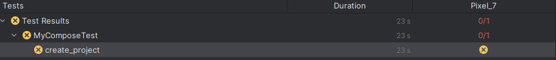
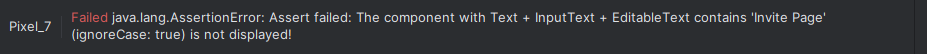

# Testing and Code Review

## 1. Change History

| **Change Date**   | **Modified Sections** | **Rationale** |
| ----------------- | --------------------- | ------------- |
| _Nothing to show_ |

---

## 2. Back-end Test Specification: APIs

### 2.1. Locations of Back-end Tests and Instructions to Run Them
Create a `.env.test` file under `/backend` and populate it with `JWT_SECRET={secret}`. The secret can be taken from the `/backend/.env` file
Tests are Located in the `backend/tests/mocked` and `backend/tests/unmocked` for the mocked and unmocked tests respectively
tests can be ran with `npm test` within the `/backend` directory
#### 2.1.1. Tests
| **Interface** | **Describe Group Location, No Mocks** | **Describe Group Location, With Mocks** | **Mocked Components** |
| ----------------------------- | ---------------------------------------------------- | -------------------------------------------------- | ---------------------------------- |
| **GET /api/user/profile** | [`tests/unmocked/userProfile.test.ts#L13`](../backend/tests/unmocked/userProfile.test.ts#L13) | [`tests/mocked/userProfile.test.ts#L18`](../backend/tests/mocked/userProfile.test.ts#L18) | User Database Model, JWT Verification |
| **POST /api/user/profile** | [`tests/unmocked/updateUserProfile.test.ts#L13`](../backend/tests/unmocked/updateUserProfile.test.ts#L13) | [`tests/mocked/updateUserProfile.test.ts#L13`](../backend/tests/mocked/updateUserProfile.test.ts#L13) | User Database Model, Profile Validation, Authentication Middleware |
| **DELETE /api/user/profile** | [`tests/unmocked/deleteUserProfile.test.ts#L13`](../backend/tests/unmocked/deleteUserProfile.test.ts#L13) | [`tests/mocked/deleteUserProfile.test.ts#L13`](../backend/tests/mocked/deleteUserProfile.test.ts#L13) | User Database Model, Media Service, Authentication Middleware |
| **GET /api/user/:userId** | [`tests/unmocked/getUserById.test.ts#L13`](../backend/tests/unmocked/getUserById.test.ts#L13) | [`tests/mocked/getUserById.test.ts#L13`](../backend/tests/mocked/getUserById.test.ts#L13) | User Database Model, JWT Authentication, ObjectId Validation |
| **POST /api/auth/signin** | [`tests/unmocked/authSignin.test.ts#L11`](../backend/tests/unmocked/authSignin.test.ts#L11) | [`tests/mocked/authSignin.test.ts#L13`](../backend/tests/mocked/authSignin.test.ts#L13) | Google OAuth2 Client, Auth Service, User Database |
| **POST /api/auth/signup** | [`tests/unmocked/authSignup.test.ts#L13`](../backend/tests/unmocked/authSignup.test.ts#L13) | [`tests/mocked/authSignup.test.ts#L13`](../backend/tests/mocked/authSignup.test.ts#L13) | Google OAuth2 Client, Auth Service, User Database Model |
| **POST /api/projects** | [`tests/unmocked/createProject.test.ts#L13`](../backend/tests/unmocked/createProject.test.ts#L13) | [`tests/mocked/createProject.test.ts#L14`](../backend/tests/mocked/createProject.test.ts#L14) | Project Database Model, User Database Model, Invitation Code Generator |
| **POST /api/projects, GET /api/projects, PUT /api/projects/:projectId** | [`tests/unmocked/projectManagement.test.ts#L17`](../backend/tests/unmocked/projectManagement.test.ts#L17) | [`tests/mocked/projectManagement.test.ts#L147`](../backend/tests/mocked/projectManagement.test.ts#L147) | ProjectController Class, Project Database Model, User Authorization, Authentication Middleware |
| **PUT /api/projects/:projectId** | [`tests/unmocked/updateProject.test.ts#L13`](../backend/tests/unmocked/updateProject.test.ts#L13) | [`tests/mocked/updateProject.test.ts#L13`](../backend/tests/mocked/updateProject.test.ts#L13) | Project Database Model, Authentication Middleware, Validation Middleware |
| **DELETE /api/projects/:projectId** | [`tests/unmocked/deleteProject.test.ts#L16`](../backend/tests/unmocked/deleteProject.test.ts#L16) | [`tests/mocked/deleteProject.test.ts#L16`](../backend/tests/mocked/deleteProject.test.ts#L16) | Project Database Model, User Database Model, Authentication Middleware |
| **POST /api/projects/join** | [`tests/unmocked/joinProject.test.ts#L13`](../backend/tests/unmocked/joinProject.test.ts#L13) | [`tests/mocked/joinProject.test.ts#L13`](../backend/tests/mocked/joinProject.test.ts#L13) | Project Database Model, Authentication Middleware, Validation Middleware |
| **DELETE /api/projects/:projectId/members/:userId** | [`tests/unmocked/removeMember.test.ts#L16`](../backend/tests/unmocked/removeMember.test.ts#L16) | [`tests/mocked/removeMember.test.ts#L16`](../backend/tests/mocked/removeMember.test.ts#L16) | Project Database Model, User Database Model, Authentication Middleware |
| **POST /api/projects/:projectId/resources** | [`tests/unmocked/addResource.test.ts#L13`](../backend/tests/unmocked/addResource.test.ts#L13) | [`tests/mocked/addResource.test.ts#L13`](../backend/tests/mocked/addResource.test.ts#L13) | Project Database Model, Authentication Middleware, Validation Middleware |
| **POST /api/projects/:projectId/tasks** | [`tests/unmocked/createTask.test.ts#L14`](../backend/tests/unmocked/createTask.test.ts#L14) | [`tests/mocked/createTask.test.ts#L16`](../backend/tests/mocked/createTask.test.ts#L16) | Task Database Model, User Database Model |
| **GET /api/projects/:projectId/tasks** | [`tests/unmocked/taskManagement.test.ts#L13`](../backend/tests/unmocked/taskManagement.test.ts#L13) | [`tests/mocked/taskManagement.test.ts#L14`](../backend/tests/mocked/taskManagement.test.ts#L14) | Task Controller, Auth Middleware, Task Database Model, User Authorization |
| **GET /api/tasks/:taskId** | [`tests/unmocked/taskManagement.test.ts#L13`](../backend/tests/unmocked/taskManagement.test.ts#L13) | [`tests/mocked/taskManagement.test.ts#L14`](../backend/tests/mocked/taskManagement.test.ts#L14) | Task Controller, Auth Middleware, Task Database Model, User Authorization |
| **PUT /api/tasks/:taskId** | [`tests/unmocked/taskManagement.test.ts#L13`](../backend/tests/unmocked/taskManagement.test.ts#L13) | [`tests/mocked/taskManagement.test.ts#L14`](../backend/tests/mocked/taskManagement.test.ts#L14) | Task Controller, Auth Middleware, Task Database Model, User Authorization |
| **DELETE /api/tasks/:taskId** | [`tests/unmocked/taskManagement.test.ts#L13`](../backend/tests/unmocked/taskManagement.test.ts#L13) | [`tests/mocked/taskManagement.test.ts#L14`](../backend/tests/mocked/taskManagement.test.ts#L14) | Task Controller, Auth Middleware, Task Database Model, User Authorization |
| **POST /api/expenses** | [`tests/unmocked/createExpense.test.ts#L13`](../backend/tests/unmocked/createExpense.test.ts#L13) | [`tests/mocked/createExpense.test.ts#L14`](../backend/tests/mocked/createExpense.test.ts#L14) | Expense Database Model, Bill Split Calculation |
| **GET /api/expenses/project/:projectId** | [`tests/unmocked/expenseOperations.test.ts#L17`](../backend/tests/unmocked/expenseOperations.test.ts#L17) | [`tests/mocked/expenseOperations.test.ts#L77`](../backend/tests/mocked/expenseOperations.test.ts#L77) | Expense Database Model, User Authorization, Project Access Control |
| **DELETE /api/expenses/:expenseId** | [`tests/unmocked/expenseOperations.test.ts#L17`](../backend/tests/unmocked/expenseOperations.test.ts#L17) | [`tests/mocked/expenseOperations.test.ts#L77`](../backend/tests/mocked/expenseOperations.test.ts#L77) | Expense Database Model, User Authorization, Project Access Control |
| **POST /api/chat/:projectId/messages** | [`tests/unmocked/sendChatMessage.test.ts#L11`](../backend/tests/unmocked/sendChatMessage.test.ts#L11) | [`tests/mocked/sendChatMessage.test.ts#L11`](../backend/tests/mocked/sendChatMessage.test.ts#L11) | Chat Message Database Model, Project Access Control, WebSocket Service |
| **GET /api/chat/:projectId/messages** | [`tests/unmocked/getChatMessages.test.ts#L13`](../backend/tests/unmocked/getChatMessages.test.ts#L13) | [`tests/mocked/getChatMessages.test.ts#L13`](../backend/tests/mocked/getChatMessages.test.ts#L13) | Chat Message Database Model, Project Access Control, Message Pagination |
| **DELETE /api/chat/:projectId/messages/:messageId** | [`tests/unmocked/deleteChatMessage.test.ts#L13`](../backend/tests/unmocked/deleteChatMessage.test.ts#L13) | [`tests/mocked/deleteChatMessage.test.ts#L13`](../backend/tests/mocked/deleteChatMessage.test.ts#L13) | Chat Message Database Model, User Authorization, Message Ownership Validation |
| **WebSocket /chat** | [`tests/unmocked/chatWebSocketService.test.ts#L12`](../backend/tests/unmocked/chatWebSocketService.test.ts#L12) | [`tests/mocked/chatWebSocketService.test.ts#L14`](../backend/tests/mocked/chatWebSocketService.test.ts#L14) | Socket.IO Server, JWT Authentication Middleware, WebSocket Broadcasting, Project Room Management |
| **POST /api/media/upload** | [`tests/unmocked/uploadImage.test.ts#L11`](../backend/tests/unmocked/uploadImage.test.ts#L11) | [`tests/mocked/uploadImage.test.ts#L16`](../backend/tests/mocked/uploadImage.test.ts#L16) | Media Service, File System Operations, Multer File Handling |
| **GET /api/calendar/status** | [`tests/unmocked/calendar.test.ts#L16`](../backend/tests/unmocked/calendar.test.ts#L16) | [`tests/mocked/calendar.test.ts#L77`](../backend/tests/mocked/calendar.test.ts#L77) | Calendar Controller, User Database Model, Google OAuth Service |
| **GET /api/calendar/oauth/authorize** | [`tests/unmocked/calendarAuthorize.test.ts#L16`](../backend/tests/unmocked/calendarAuthorize.test.ts#L16) | [`tests/mocked/calendarAuthorize.test.ts#L16`](../backend/tests/mocked/calendarAuthorize.test.ts#L16) | Calendar Service, Authentication Middleware, OAuth URL Generation |
| **POST /api/calendar/enable** | [`tests/unmocked/calendarEnable.test.ts#L13`](../backend/tests/unmocked/calendarEnable.test.ts#L13) | [`tests/mocked/calendarEnable.test.ts#L13`](../backend/tests/mocked/calendarEnable.test.ts#L13) | User Database Model, Authentication Middleware, Calendar Service |
| **POST /api/calendar/disable** | [`tests/unmocked/calendarDisable.test.ts#L13`](../backend/tests/unmocked/calendarDisable.test.ts#L13) | [`tests/mocked/calendarDisable.test.ts#L13`](../backend/tests/mocked/calendarDisable.test.ts#L13) | User Database Model, Authentication Middleware |
| **POST /api/calendar/disconnect** | [`tests/unmocked/calendarDisconnect.test.ts#L13`](../backend/tests/unmocked/calendarDisconnect.test.ts#L13) | [`tests/mocked/calendarDisconnect.test.ts#L13`](../backend/tests/mocked/calendarDisconnect.test.ts#L13) | User Database Model, Calendar Service, Authentication Middleware |


#### 2.1.2. Commit Hash Where Tests Run

`[Insert Commit SHA here]`

#### 2.1.3. Explanation on How to Run the Tests

1. **Clone the Repository**:
   ```bash
   git clone https://github.com/justinishiguro/cpen-321-project.git
   cd cpen-321-project/backend
   ```

2. **Install Dependencies**:
   ```bash
   npm install
   ```

3. **Set Up Environment Variables**:
   - Create a `.env` file in the backend directory
   - Add required environment variables (JWT_SECRET, MongoDB connection string, etc.)

4. **Run All Tests**:
   ```bash
   npm run test
   ```

5. **Run Tests Without Mocks Only**:
   ```bash
   npm run test:unmocked
   ```

6. **Run Tests With Mocks Only**:
   ```bash
   npm run test:mocked
   ```

7. **Run Non-Functional Requirement Tests Only**:
   ```bash
   npm run test:nonfunctional
   ```

8. **Run Tests with Coverage Report**:
   ```bash
   npm run test:coverage
   ```

### 2.2. GitHub Actions Configuration Location

`~/.github/workflows/backend-tests.yml`

### 2.3. Jest Coverage Report Screenshots for Tests Without Mocking

  


### 2.4. Jest Coverage Report Screenshots for Tests With Mocking

  

### 2.5. Jest Coverage Report Screenshots for Both Tests With and Without Mocking

  

---

## 3. Back-end Test Specification: Tests of Non-Functional Requirements

### 3.1. Test Locations in Git

| **Non-Functional Requirement**  | **Location in Git**                              |
| ------------------------------- | ------------------------------------------------ |
| **Performance (Response Time)** | [`tests/nonfunctional/response_time.test.ts`](../backend/tests/nonfunctional/response_time.test.ts) |
| **Data Security & Authorization** | [`tests/nonfunctional/data_security.test.ts`](../backend/tests/nonfunctional/data_security.test.ts) |
| **Real-time Communication (WebSocket)** | [`tests/mocked/chatWebSocketService.test.ts`](../backend/tests/mocked/chatWebSocketService.test.ts) & [`tests/unmocked/chatWebSocketService.test.ts`](../backend/tests/unmocked/chatWebSocketService.test.ts) |

### 3.2. Test Verification and Logs

- **Performance (Response Time)**

  - **Verification:** This test suite measures API response times to ensure acceptable performance under normal operating conditions. It includes three main test scenarios: (1) Health check endpoint should respond within 200ms, (2) Multiple concurrent requests should complete within 1000ms total, and (3) Sequential requests should maintain consistent performance with each request under 500ms. The tests use Jest with supertest to measure actual response times and validate that the system meets performance requirements for good user experience.
  - **Test Cases:**
    - `should respond to health check within 200ms`: Tests basic endpoint responsiveness
    - `should handle multiple concurrent requests within acceptable time`: Tests system performance under concurrent load (5 simultaneous requests)
    - `should maintain performance under sequential load`: Tests consistent performance over 10 sequential requests
  - **Performance Thresholds:**
    - Individual request: < 500ms
    - Concurrent batch (5 requests): < 1000ms total
    - Health check: < 200ms
    - Average sequential performance: < 200ms
  - **Log Output Example**
    ```
    ⏱️  Testing health check endpoint response time...
    📊 Response time: 45ms
    ⏱️  Testing concurrent request performance...
    📊 Total time for 5 requests: 234ms
    📊 Average time per request: 46.8ms
    ⏱️  Testing sequential request performance...
    📊 Average response time across 10 requests: 52ms
    📊 Maximum response time: 78ms
    ```

- **Data Security & Authorization**

  - **Verification:** This test suite validates that users can only access data they are authorized to view, ensuring proper data isolation and privacy protection. It tests three main security areas: (1) Chat message access control - users cannot read messages from projects they're not members of, (2) Project access security - users cannot see projects they don't have access to, and (3) Token security validation - invalid tokens are properly rejected and token validation performs efficiently under load.
  - **Test Cases:**
    - `should deny access to chat messages from unauthorized project`: Tests data isolation between user groups
    - `should allow access to chat messages for authorized project member`: Validates legitimate access works correctly
    - `should prevent unauthorized users from sending messages to private projects`: Tests write access control
    - `should deny unauthorized access to project information`: Tests project-level data privacy
    - `should allow authorized access to own project information`: Validates authorized project access
    - `should reject requests with invalid JWT tokens`: Tests token validation security
    - `should reject requests without authentication tokens`: Tests missing token handling
    - `should validate token performance under load`: Tests authentication performance under repeated requests
  - **Security Thresholds:**
    - Access denial response time: < 500ms
    - Token validation time: < 100ms per request
    - Average token validation performance: < 50ms
    - All unauthorized access attempts: Must return 401/403 status codes

---

## 4. Front-end Test Specification
**Front-end Test Prerequisites:**
1. Ensure that a user was previously signed into the app with Google (the tests click the first email after clicking "Sign In With Google"
2. Ensure that a project named "Test1" was previously created (this project name is utilized in tests)
3. Ensure that your "Name" under "Manage Profile" is "Test User" (this name is utilized in tests)
### 4.1. Location in Git of Front-end Test Suite:

`cpen-321-project\frontend\app\src\androidTest\java\com\cpen321\usermanagement\MyComposeTest.kt`

### 4.2. Tests

- **Use Case: Creating a New Project (Use Case 2)**

  - **Expected Behaviors:**
    | **Scenario Steps** | **Test Case Steps** |
    | ------------------ | ------------------- |
    | 1. The app displays a "Create New Project" button which the user clicks | Check button labelled "Create New Project" is present on screen.<br>Click button labelled "Create New Project". |
    | 2. The app displays a "Create New Project" form | Check "Create New Project" form is present on screen. |
    | 3a. The user inputs an empty project name | Check button labelled "Create" is disabled. |
    | 3. The user inputs a non-empty project name and optional description | Input "ProjectRandomNumber" under "Project Name". |
    | 4. The user clicks the "Create" button | Check button labelled "Create" is enabled.<br>Click "Create" button. |
    | 5. The user is taken to an invite page | Check text "Invite Page" is present on screen. |
    | 6a. The user enters an invalid email address | Check "Invite User" input is present on screen.<br>Input "test" under "Invite User".<br>Check button labelled "Send Invites" is present on screen.<br>Click button labelled "Send Invites". |
    | 6a1. The app displays an error message prompting the user to input a valid email address | Check dialog is opened with text: "Please enter a valid email address". |
    | 6. The user enters the email addresses of other users they want to invite to the project | Check "Invite User" input is present on screen.<br>Input "c62826472@gmail.com" under "Invite User". |
    | 7. The user clicks the "Send Invites" button | Check button labelled "Send Invites" is present on screen.<br>Click button labelled "Send Invites". |
    | 8. The user sees a success message | Check dialog is opened with text: "Users were invited successfully!" |
    | 9. The user is redirected to the home screen | Check project is visible on screen: "ProjectRandomNumber". |

  - **Test Logs:**
    ```
    Note: This test currently fails because the invite users page has not been implemented yet.
    Test execution requires completion of the user invitation feature.
    ```
    
    


- **Use Case: Adding Project Expenses (Use Case 4)**

  - **Expected Behaviors:**
    | **Scenario Steps** | **Test Case Steps** |
    | ------------------ | ------------------- |
    | 1. The user opens an existing project | Click on "Test1" project to open project screen. |
    | 2. The app displays an "Expense" button which the user clicks | Check button labelled "Expense" is present on screen.<br>Click button labelled "Expense". |
    | 3. The app displays an "Add Expense" button which the user clicks | Check button labelled "Add Expense" is present on screen.<br>Click button labelled "Add Expense". |
    | 4. The app displays an "Add New Expense" form | Check "Add New Expense" form is present on screen. |
    | 5a. The user inputs an empty description | Click "Add Expense" button on form. |
    | 5a1. The app displays an error message prompting the user to input valid values | Check dialog is opened with text: "Please fill all fields correctly". |
    | 5b. The user inputs a non-numeric amount | Input "Test randomAmount" in "Description" text field.<br>Input "NON_INTEGER" in "Amount" text field.<br>Select "Arnav Prasad" in "Paid By" dropdown.<br>Select "Arnav Prasad" in "Split Between" section.<br>Click "Add Expense" button on form. |
    | 5b1. The app displays an error message prompting the user to input valid values | Check dialog is opened with text: "Please fill all fields correctly". |
    | 5c. The user does not select who paid | Input "Test randomAmount" in "Description" text field.<br>Input "randomAmount" in "Amount" text field.<br>Select "Arnav Prasad" in "Split Between" section.<br>Click "Add Expense" button on form. |
    | 5c1. The app displays an error message prompting the user to input valid values | Check dialog is opened with text: "Please fill all fields correctly". |
    | 5d. The user does not select who to split expense between | Input "Test randomAmount" in "Description" text field.<br>Input "randomAmount" in "Amount" text field.<br>Select "Arnav Prasad" in "Paid By" dropdown.<br>Click "Add Expense" button on form. |
    | 5d1. The app displays an error message prompting the user to input valid values | Check dialog is opened with text: "Please fill all fields correctly". |
    | 5. The user inputs valid inputs | Input "Test randomAmount" in "Description" text field.<br>Input "randomAmount" in "Amount" text field.<br>Select "Arnav Prasad" in "Paid By" dropdown.<br>Select "Arnav Prasad" in "Split Between" section. |
    | 6. The user clicks the "Add Expense" button | Click "Add Expense" button on form. |
    | 7. The user can view the new expense | Check the description "Test (randomAmount)" is present on screen.<br>Check the amount "(randomAmount)" is present on screen.<br>Check the paid by user "Arnav Prasad" is present on screen.<br>Check the split between user(s) "Arnav Prasad" is present on the screen. |

  - **Test Logs:**
    ```
    Task :app:connectedDebugAndroidTest
    Starting 1 tests on Pixel_7(AVD) - 13
    Connected to process 21754 on device 'Pixel_7 [emulator-5554]'.

    Pixel_7(AVD) - 13 Tests 0/1 completed. (0 skipped) (0 failed)
    Finished 1 tests on Pixel_7(AVD) - 13

    BUILD SUCCESSFUL in 56s
    72 actionable tasks: 1 executed, 71 up-to-date
    ```
    
    

- **Use Case: Creating/Assigning Project Tasks and Deadlines to Group Members (Use Case 5)**

  - **Expected Behaviors:**
    | **Scenario Steps** | **Test Case Steps** |
    | ------------------ | ------------------- |
    | 1. The user opens an existing project | Click on "Test1" project to open project screen. |
    | 2. The app displays a "Task Board" button which the user clicks | Check button labelled "Task Board" is present on screen.<br>Click button labelled "Task Board". |
    | 3. The app displays a "Create Task" button which the user clicks | Check button labelled "Create Task" is present on screen.<br>Click button labelled "Create Task". |
    | 4. The app displays an "Create New Task" form | Check "Create New Task" form is present on screen. |
    | 5a. The user inputs an empty task name | Select "Arnav Prasad" under "Assignee" dropdown.<br>Select "TODAY_DATE" under "Deadline".<br>Select "In progress" under "Status" dropdown.<br>Click "Create" button. |
    | 5a1. The app displays an error message prompting the user to input a non empty task | Check dialog is opened with text: "Task name cannot be empty". |
    | 5b. The user does not select an "Assignee" | Input "Task1" under "Task Name".<br>Select "TODAY_DATE" under "Deadline".<br>Select "In progress" under "Status" dropdown.<br>Click "Create" button. |
    | 5b1. The app displays an error message prompting the user to input a non empty Assignee | Check dialog is opened with text: "Assignee cannot be empty". |
    | 5c. The user selects a date that has already passed | Input "Task1" under "Task Name".<br>Select "Arnav Prasad" under "Assignee" dropdown.<br>Select "In progress" under "Status" dropdown.<br>Select "TODAY_DATE - 1" under "Deadline".<br>Click "Create" button. |
    | 5c1. The app displays an error message prompting the user to input a future date | Check dialog is opened with text: "Please enter a future date". |
    | 5. The user inputs valid inputs | Input "TaskRandomNumber" under "Task Name".<br>Select "Arnav Prasad" under "Assignee" dropdown.<br>Select "In progress" under "Status" dropdown.<br>Select "TODAY_DATE" under "Deadline". |
    | 6. The user clicks the "Create" button | Click "Create" button. |
    | 7. The user can view the new task | Check the Task Name "TaskRandomNumber" is present on screen.<br>Check the Assignee "Arnav Prasad" is present on screen.<br>Check the date "TODAY_DATE" is present on screen.<br>Check the status "In progress" is present on screen. |

  - **Test Logs:**
    ```
    Task :app:connectedDebugAndroidTest
    Starting 1 tests on Pixel_7(AVD) - 13

    Pixel_7(AVD) - 13 Tests 0/1 completed. (0 skipped) (0 failed)
    Pixel_7(AVD) - 13 Tests 1/1 completed. (0 skipped) (0 failed)
    Finished 1 tests on Pixel_7(AVD) - 13

    BUILD SUCCESSFUL in 57s
    72 actionable tasks: 1 executed, 71 up-to-date
    ```
    
    

---

## 5. Automated Code Review Results

### 5.1. Commit Hash Where Codacy Ran

`3db326b1b11a86b8aeef9616465dd08b143155eb`

### 5.2. Unfixed Issues per Codacy Category

   

### 5.3. Unfixed Issues per Codacy Code Pattern


 Not applicable as there are no Codacy issues (see above image).

### 5.4. Justifications for Unfixed Issues
 Not applicable as there are no Codacy issues (see above image).
